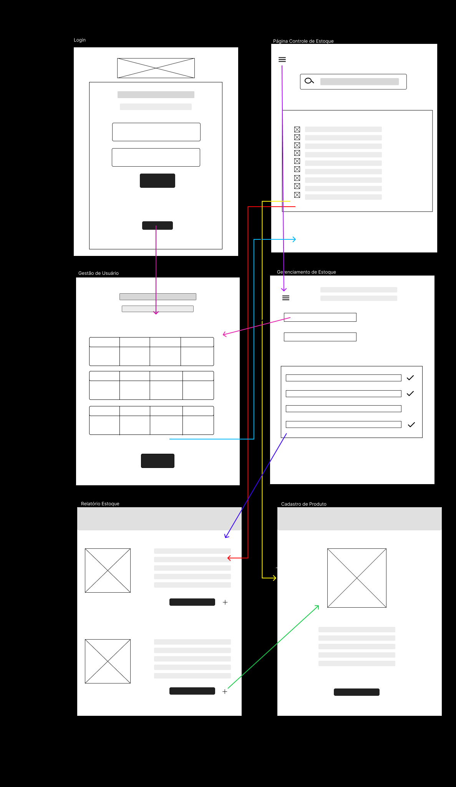
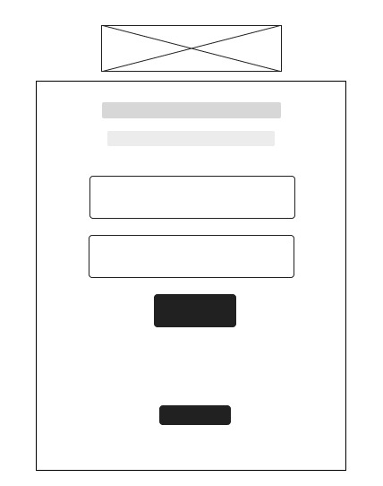
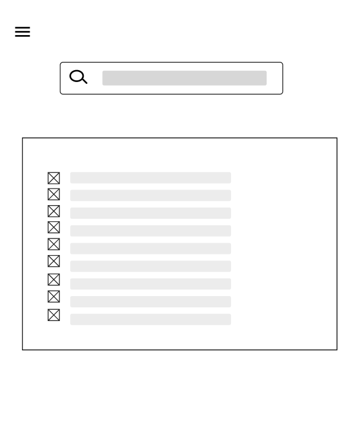
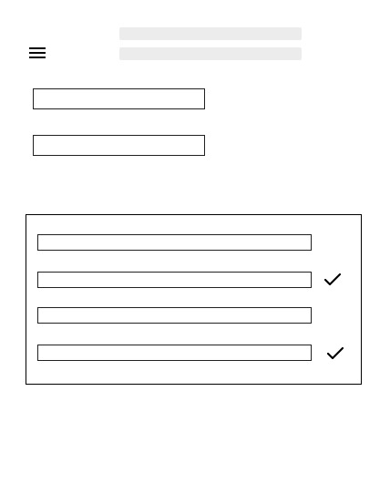
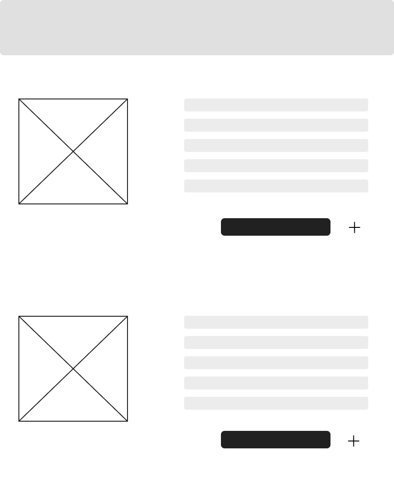
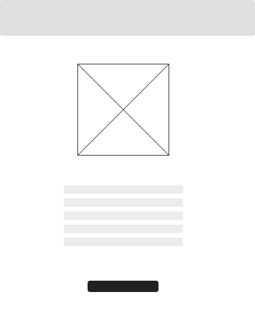
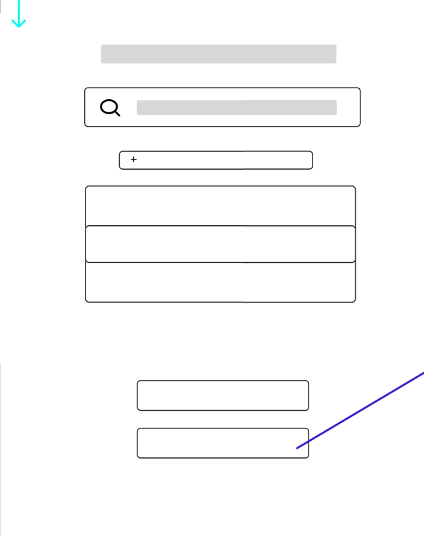
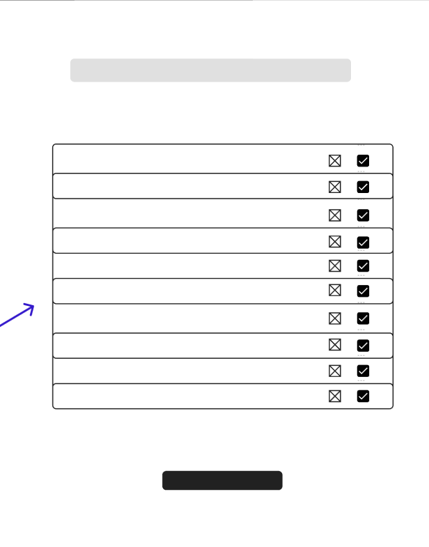
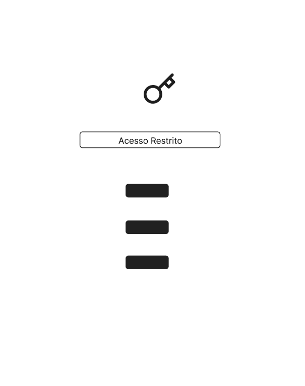

# Projeto de Interface

 Os fluxos de usuário são ferramentas essenciais para mapear o caminho que os visitantes seguem para concluir tarefas em um website. Eles são fundamentais na criação do site e na análise das interações que ocorrem durante a jornada do usuário. O diagrama de fluxo a seguir ilustra o percurso do usuário na aplicação desenvolvida para este projeto.

<figure>
   <figcaption>Figura -Demonstração do Fluxo do Usuário</figcaption>
</figure>

## Protótipo

### Protótipo de baixa fidelidade

 Com o propósito da criação do design de interface, foi projetado o wireframe de baixa fidelidade para auxiliar na diagramação da página, com o intuito de esboçar, dessa forma, o produto final. 

Para auxiliar na diagramação da página e esboçar o produto final, foi projetado o wireframe de baixa fidelidade com o propósito de criar o design de interface.
 

## Tela do Login

A tela de Login permitirá que o usuário acesse o sistema e complete seu cadastro com as informações solicitadas. As credenciais registradas ajudarão na identificação do usuário no sistema. Os componentes da tela são:

<figure>
   <figcaption>Tela de Login </figcaption>
</figure>

<em> Login:</em>  Um formulário com campos de entrada (input) onde o usuário pode inserir seu e-mail e senha.
Entrar: Após preencher e enviar o e-mail e a senha, o botão "Entrar" permitirá ao usuário realizar o login e ser direcionado para as demais interações do website.
Além disso, o sistema está integrado com um banco de dados que armazena as credenciais dos usuários de forma segura, garantindo uma autenticação eficiente e proteção das informações pessoais.<em>

## Controle de Estoque

O wireframe da página de controle de estoque é um esboço que mostra a estrutura e os principais elementos da página. Ele ajuda a planejar como o controle de estoque será exibido e usado.

<em> Lista de Itens:</em>  Exibe produtos com nome, quantidade e preço. 
<em> Filtros:</em>  Permitem buscar por categoria, data e outros critérios. 
<em> Botões de Ações:</em>  Incluem "Adicionar Novo Item", "Atualizar Estoque" e "Excluir".

<figure>
  
</figure>

## Central de Usuários 

A  página de gestão de usuário é um esboço que mostra como a página será organizada e os principais recursos que ela terá e  ajuda a planejar a gestão de usuários de forma clara e prática.

<em> Lista de Usuário:</em> Exibe todos os usuários com nome, e-mail e status.
<em> Botões de Ação:</em> Como "Adicionar Novo Usuário" e "Excluir". 
<em> Detalhes do Usuário:</em> Mostra informações de cada usuário.

<figure>
   
</figure>

## Gerenciamento de Estoque 

<figure>
  
</figure>

Um wireframe de controle de estoque para uma página de back-end tem como objetivo organizar visualmente os elementos necessários para gerenciar o estoque de produtos. Ele inclui seções básicas como:

<em>Listagem de produtos:</em> Tabela com nome,quantidade disponível.
<em>Botão de adicionar produto:</em> Para incluir novos itens no estoque.
<em>Relatórios e estatísticas:</em> Resumo de movimentações.

## Relatório de Estoque

<figure>
  
</figure>

 Um wireframe para a página de controle de estoque em um sistema back-end, voltado para relatórios de estoque, incorpora seções essenciais para a apresentação, análise dos dados e operações CRUD (Create, Read, Update e Delete).

## Cadastro de Usuários

 Um wireframe para a página de controle de estoque em um sistema back-end, focado no cadastro de produtos, organiza de maneira clara e eficiente os campos necessários para a gestão. Este wireframe apresenta uma estrutura simplificada, que inclui os principais elementos para a inserção, visualização e modificação de informações dos produtos. Ao definir esses campos de forma ordenada, o wireframe facilita a administração do estoque e aprimora a eficiência no processo de cadastro e controle de produtos.

<figure>
   
</figure>

## Tela Geradora de Relatórios e Fichas

A tela geradora de relatórios e fichas para gestão de estoque é uma ferramenta que facilita o controle dos produtos armazenados. Os usuários podem inserir e visualizar informações como quantidade de itens, datas de validade e fornecedores.

A tela geradora de relatórios  permite aos usuários criar e visualizar relatórios detalhados sobre os produtos armazenados. Nela, é possível selecionar critérios específicos, como data, categoria de produtos e níveis de estoque, para gerar relatórios personalizados.

<figure>
   
</figure>

## Tela de Envio de Fichas

A tela de envio de fichas para gestão de estoque é uma ferramenta que facilita o registro e a atualização das informações dos produtos. É possível selecionar o item desejado de uma lista suspensa ou campo de busca, ajudando a evitar erros. Pode-se inserir informações importantes, como a quantidade de unidades disponíveis, a data de validade para itens perecíveis e o nome do fornecedor.

Após preencher os dados, há um botão “Enviar” que, ao ser clicado, salva as informações no sistema, acompanhada de uma confirmação visual de que o envio foi ocorrido com sucesso.

<figure>
   

</figure>

## Tela Solicitar Acesso

 A tela de solicitação de acesso para a gestão de estoque, permite que usuários solicitem permissões para gerenciar as informações do estoque. O usuário deve preencher um formulário com seus dados, como nome, e-mail e cargo, além de especificar o motivo da solicitação. Após enviar o formulário, um aviso é gerado para os administradores, que poderão revisar e aprovar ou rejeitar o acesso.

<figure>
   
 </figure>

## Diagrama de Fluxo

<figure>
   
 </figure>
