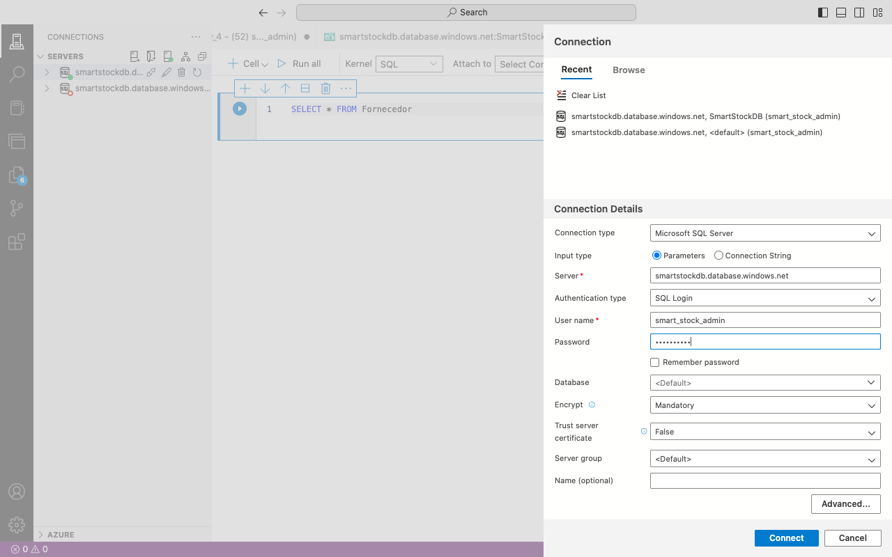
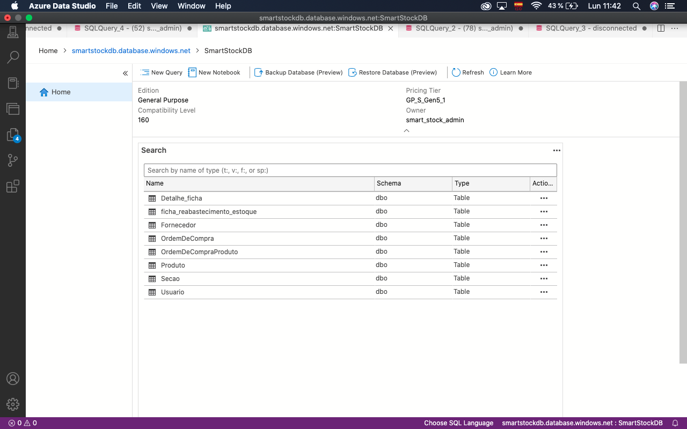
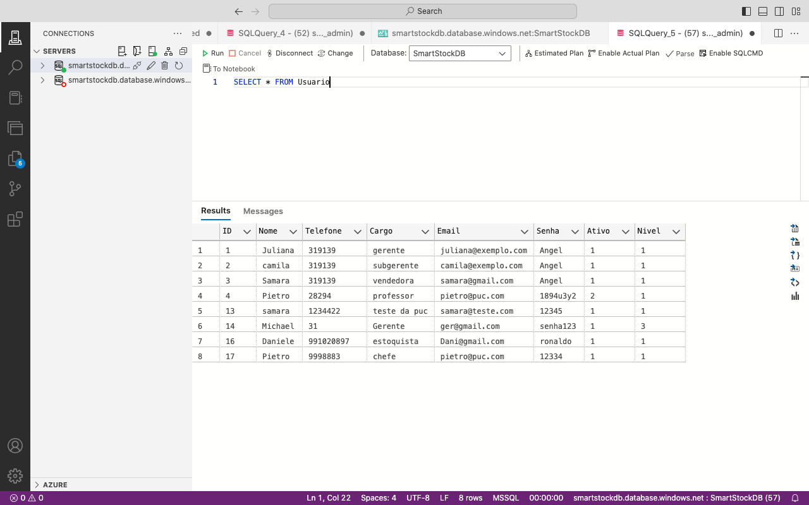
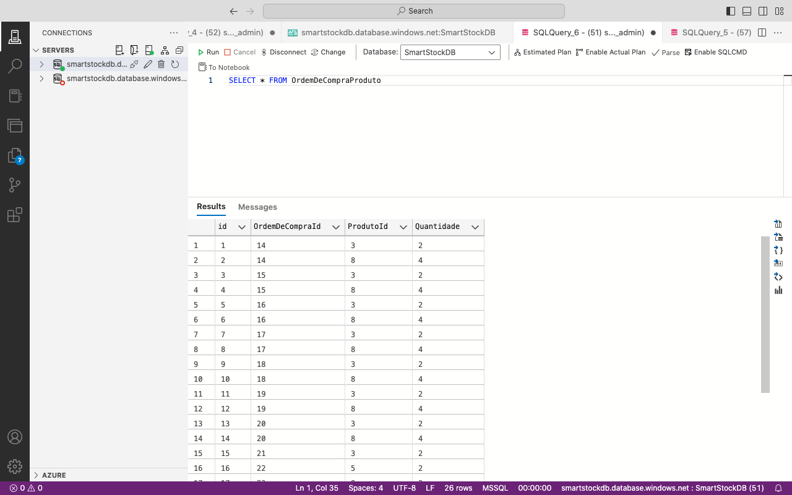
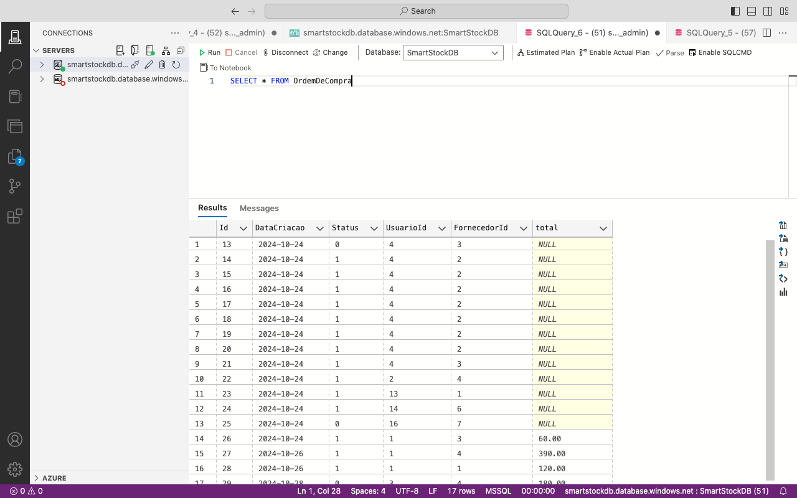

# Arquitetura da Solução

## Diagrama de Classes

O diagrama de classes ilustra graficamente como será a estrutura do software, e como cada uma das classes da sua estrutura estarão interligadas. Essas classes servem de modelo para materializar os objetos que executarão na memória.

## Modelo ER (Projeto Conceitual)

O Modelo ER representa através de um diagrama como as entidades (coisas, objetos) se relacionam entre si na aplicação interativa.

## Projeto da Base de Dados

O projeto da base de dados corresponde à representação das entidades e relacionamentos identificadas no Modelo ER, no formato de tabelas, com colunas e chaves primárias/estrangeiras necessárias para representar corretamente as restrições de integridade.

## Tecnologias Utilizadas

 - C# é uma linguagem de programação orientada a objetos da Microsoft, essencial para o desenvolvimento de soluções backend, especialmente com a plataforma .NET.

O C# é utilizado no backend para desenvolver a lógica de negócios e processar dados, C# garante que as operações realizadas no servidor, como requisições e manipulação de informações, sejam rápidas e seguras, refletindo em um desempenho ideal para o usuário final.

 - Azure é a plataforma de nuvem da Microsoft, oferecendo serviços de computação em nuvem para hospedar e gerenciar aplicativos backend, garantindo escalabilidade e segurança.

O Azure fornece infraestrutura em nuvem para hospedar e gerenciar o backend das aplicações. Isso permite que os serviços e dados estejam disponíveis de forma confiável e escalável, garantindo uma experiência sem interrupções para os usuários, independentemente da carga de acessos.

 - ASP.NET é um framework da Microsoft usado no desenvolvimento de aplicações web e APIs, sendo amplamente utilizado no backend para criar soluções dinâmicas e escaláveis.

 O ASP.NET cria APIs e aplicações web que se comunicam diretamente com o backend, processando as interações dos usuários. Ele garante que a experiência do usuário seja fluida, ao lidar com requisições e fornecer respostas rápidas e seguras.
Essas tecnologias são fundamentais para o desenvolvimento de sistemas backend eficientes e seguros.

Observa-se que essas tecnologias se relacionam com o usuário no backend principalmente por meio da criação de aplicativos e serviços eficientes, seguros e escaláveis que impactam diretamente na experiência do usuário, mesmo que de forma indireta.
 Apesar das tecnologias mencionadas atuarem principalmente no backend, são essenciais para que o usuário tenha uma experiência final eficiente, segura e sem falhas.

 - GitHub é uma plataforma de hospedagem de código-fonte que utiliza o sistema de controle de versão Git. É amplamente usada por desenvolvedores para gerenciar, compartilhar e colaborar em projetos de software. Através do GitHub, equipes podem versionar o código, controlar alterações e trabalhar de forma colaborativa em tempo real.

## Hospedagem

O Azure Data Studio é uma ferramenta de código aberto da Microsoft, projetada para o gerenciamento de bancos de dados como SQL Server e Azure SQL Database. Com uma interface gráfica intuitiva, facilita a administração de dados e a manipulação de tabelas, tornando o gerenciamento de bancos de dados mais eficiente e acessível. Além disso, o Azure Data Studio permite a criação, modificação e visualização de tabelas de forma simplificada. Os usuários podem executar consultas SQL, alterar a estrutura das tabelas e consultar dados de maneira rápida e eficaz, otimizando a administração de bancos de dados relacionais.

 

A ferramenta também se integra facilmente a serviços de hospedagem em nuvem como o Azure SQL Database, permitindo o gerenciamento de bancos de dados hospedados na nuvem de forma simples e prática. A integração com a plataforma Azure oferece escalabilidade, segurança avançada e alta disponibilidade, tornando-a uma solução ideal para quem busca administrar bancos de dados tanto locais quanto na nuvem, com o benefício de otimizar custos e recursos de infraestrutura.

 

<figure>
   
 </figure>

 

<figure>
   
 </figure>

  
- Tabela Usuário

<figure>
   
 </figure>

  

  
- Tabela Ordem de Compra e Produto
  <figure>
   
 </figure> 

  

 - Tabela Ordem de Compra 
  <figure>
   
 </figure>
 

 
