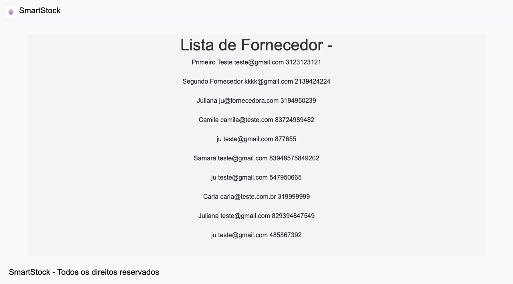
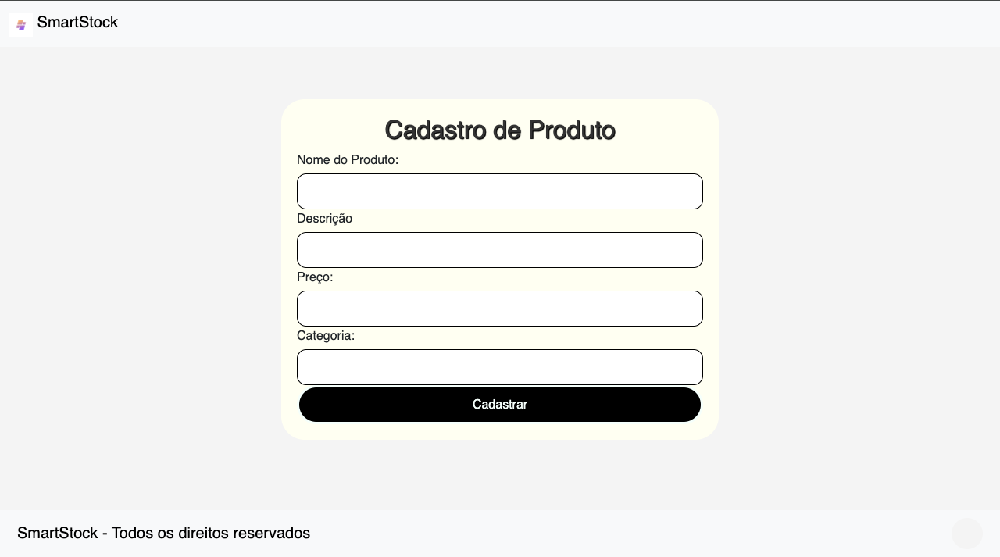

# Programação de Funcionalidades 

Pré-requisitos: <a href="2-Especificação do Projeto.md"> Especificação do Projeto</a>, <a href="3-Projeto de Interface.md"> Projeto de Interface</a>, <a href="4-Metodologia.md"> Metodologia</a>, <a href="3-Projeto de Interface.md"> Projeto de Interface</a>, <a href="5-Arquitetura da Solução.md"> Arquitetura da Solução</a>

Implementação do sistema descrita por meio dos requisitos funcionais e/ou não funcionais. Nesta seção, é essencial relacionar os requisitos atendidos com os artefatos criados (código fonte) e com o(s) responsável(is) pelo desenvolvimento de cada artefato a cada etapa. Nesta seção também deverão ser apresentadas, se necessário, as instruções para acesso e verificação da **implementação que deve estar funcional no ambiente de hospedagem obrigatoriamente a partir da Etapa 03**.

Por exemplo: a tabela a seguir deverá ser preenchida considerando os artefatos desenvolvidos.

|ID    | Descrição do Requisito  | Artefatos produzidos | Aluno(a) responsável |
 |------|-----------------------------------------|----|----|
|RF-001| A aplicação deve permitir que o usuário avalie uma agência de intercâmbio com base na sua experiência|  |  |
|RF-002| A aplicação deve permitir que o usuário inclua comentários ao fazer uma avaliação de uma agência de intercâmbio     |  |  |
|RF-003| A aplicação deve permitir que o usuário consulte todas as agências de intercâmbio cadastradas ordenando-as com base em suas notas |  |  |

  

# Instruções de acesso

Acesso de forma local:

O usuário deverá clonar o repositório localmente e navegar até o diretório e executar o arquivo index.html em seu navegador de preferência.

Forma de acesso:

O usuário deverá abrir um navegador de Internet e informar a seguinte URL:  

# Página Cadastro de Fornecedor  

|ID    | Descrição do Requisito  | Tela Página Cadastro de Fornecedor | Juliana M |
|------|-----------------------------------------|----|----|
|RF-011| O sistema deve cadastrar o fornecedor e criar uma página informando que o cadastro foi realizado com sucesso. |  |  |
|RNF-005| O sistema deve ser acessível para navegadores web comuns (Chrome, Firefox) sem necessidade de plugins extras. |  |  |
|RF-12| O sistema deve permitir a inclusão de um novo fornecedor tendo incluso nome, email, telefone, endereço, cnpj.|  |  |

<figure>
  
</figure>

 

Ao clicar no botão de cadastrar fornecedor, você será redirecionado para a página de sucesso, onde uma mensagem de confirmação do cadastro do fornecedor será exibida.

<figure>

</figure>

<b>Página Lista de Fornecedor: </b>
 
 Passagem de Dados SQL para HTML.
 A primeira etapa foi executar uma query SQL em um banco de dados. Após a execução, os dados retornados foram formatados para exibição em HTML.

 <figure>
  
</figure>

 

# Página Cadastro de Produto

|ID    | Descrição do Requisito  | Tela Página Cadastro de Produto | Juliana M |
|------|-----------------------------------------|----|----|
|RF-013| O sistema deve cadastrar o produto e criar uma página informando que o cadastro foi realizado com sucesso. |  |  |
|RNF-005| O sistema deve ser acessível para navegadores web comuns (Chrome, Firefox) sem necessidade de plugins extras. |  |  |
|RNF-01| O sistema deve ter uma interface simples e fácil de usar, com design básico para facilitar a navegação para os funcionários da empresa.  |  | |
|RF-02| O sistema deve permitir a visualização de uma lista detalhada de todos os produtos cadastrados. | | |
|RF-14|O sistema deve cadastrar o produto e criar uma página informando que o cadastro foi realizado com sucesso.| | |

<figure>
  
</figure>

Ao clicar no botão de cadastrar produto , você será redirecionado para a página de sucesso, onde uma mensagem de confirmação do cadastro do produto será exibida.

<figure>

</figure>

<b>  Página Lista de Produtos:</b>

 Passagem de Dados SQL para HTML.

 A primeira etapa foi executar uma query SQL em um banco de dados. Após a execução, os dados retornados dos produtos adicionados foram formatados para exibição em HTML.

  
  <figure>
   
</figure>

---

# Página Cadastro de Produto

|ID    | Descrição do Requisito  | Tela Página Cadastro de Usuário | Michael Brasil |
|------|-----------------------------------------|----|----|
|RF-01| O sistema deve permitir o cadastro de um novo usuário com nome, telefone, cargo, email, senha e status. |  |  |
|RNF-02| O sistema deve ser responsivo e funcionar corretamente em dispositivos móveis e desktops. |  |  |
|RF-03| O sistema deve exibir uma mensagem de sucesso ao usuário após o cadastro ser realizado com sucesso.  |  | |
|RNF-04| O sistema deve ser compatível com navegadores web comuns, como Chrome, Firefox, Edge, sem necessidade de plugins extras. | | |
|RF-05|O sistema deve permitir visualizar as informações dos usuários cadastrados.| | |

<figure>
  

<figure>
  

<figure>
  
