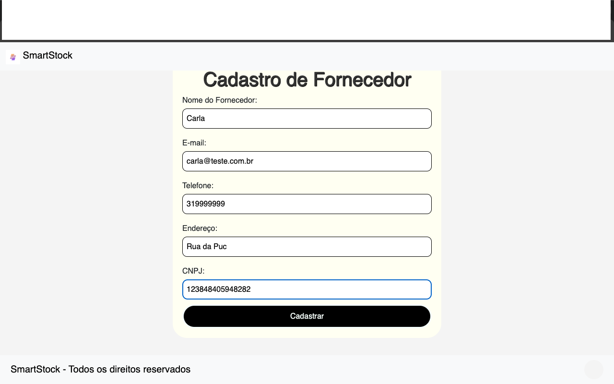
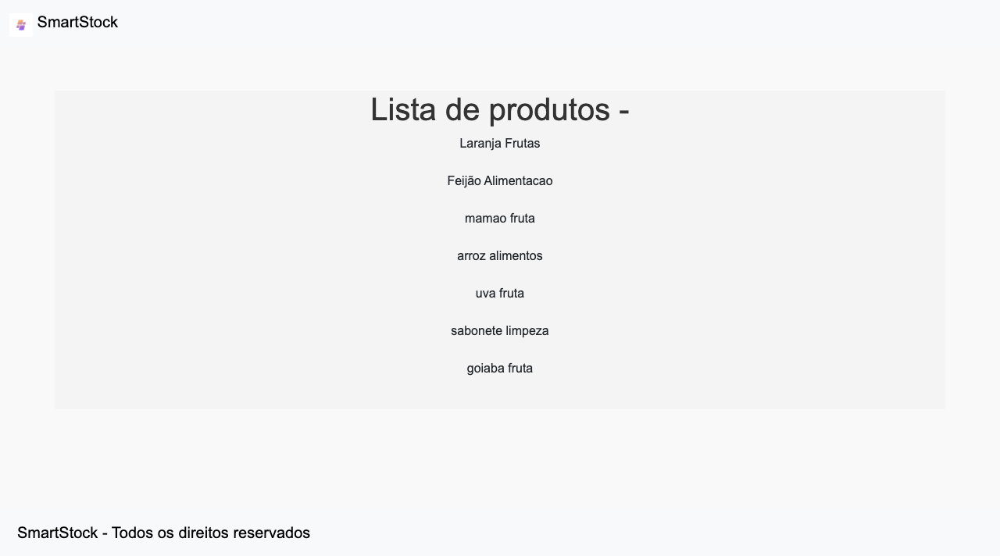

# Programação de Funcionalidades (doc ainda não preenchido, o que consta aqui é do template do github)

Pré-requisitos: <a href="2-Especificação do Projeto.md"> Especificação do Projeto</a>, <a href="3-Projeto de Interface.md"> Projeto de Interface</a>, <a href="4-Metodologia.md"> Metodologia</a>, <a href="3-Projeto de Interface.md"> Projeto de Interface</a>, <a href="5-Arquitetura da Solução.md"> Arquitetura da Solução</a>

Implementação do sistema descrita por meio dos requisitos funcionais e/ou não funcionais. Nesta seção, é essencial relacionar os requisitos atendidos com os artefatos criados (código fonte) e com o(s) responsável(is) pelo desenvolvimento de cada artefato a cada etapa. Nesta seção também deverão ser apresentadas, se necessário, as instruções para acesso e verificação da **implementação que deve estar funcional no ambiente de hospedagem obrigatoriamente a partir da Etapa 03**.

Por exemplo: a tabela a seguir deverá ser preenchida considerando os artefatos desenvolvidos.

|ID    | Descrição do Requisito  | Artefatos produzidos | Aluno(a) responsável |
 |------|-----------------------------------------|----|----|
|RF-001| A aplicação deve permitir que o usuário avalie uma agência de intercâmbio com base na sua experiência|  |  |
|RF-002| A aplicação deve permitir que o usuário inclua comentários ao fazer uma avaliação de uma agência de intercâmbio     |  |  |
|RF-003| A aplicação deve permitir que o usuário consulte todas as agências de intercâmbio cadastradas ordenando-as com base em suas notas |  |  |

  

# Instruções de acesso

Acesso de forma local:

O usuário deverá clonar o repositório localmente e navegar até o diretório e executar o arquivo index.html em seu navegador de preferência.

Forma de acesso:

O usuário deverá abrir um navegador de Internet e informar a seguinte URL:  https://icei-puc-minas-pmv-ads.github.io/PMV-ADS-2024-2-E2-Proj-Smart-Stock/

# Página Cadastro de Fornecedor  

|ID    | Descrição do Requisito  | Tela Página Cadastro de Fornecedor | Juliana M |
|------|-----------------------------------------|----|----|
|RF-011| O sistema deve cadastrar o fornecedor e criar uma página informando que o cadastro foi realizado com sucesso. |  |  |
|RNF-005| O sistema deve ser acessível para navegadores web comuns (Chrome, Firefox) sem necessidade de plugins extras. |  |  |
|RF-12| O sistema deve permitir a inclusão de um novo fornecedor tendo incluso nome, email, telefone, endereço, cnpj.|  |  |

<figure>
  
</figure>
 
<figure>
  
</figure>
 
 Página Lista de Fornecedores - Passagem de Dados SQL para HTML.

 A primeira etapa foi executar uma query SQL em um banco de dados. Após a execução, os dados retornados foram formatados para exibição em HTML.

 <figure>
  
</figure>

> **Links Úteis**:
>
> - [Trabalhando com HTML5 Local Storage e JSON](https://www.devmedia.com.br/trabalhando-com-html5-local-storage-e-json/29045)
> - [JSON Tutorial](https://www.w3resource.com/JSON)
> - [JSON Data Set Sample](https://opensource.adobe.com/Spry/samples/data_region/JSONDataSetSample.html)
> - [JSON - Introduction (W3Schools)](https://www.w3schools.com/js/js_json_intro.asp)
> - [JSON Tutorial (TutorialsPoint)](https://www.tutorialspoint.com/json/index.htm)
