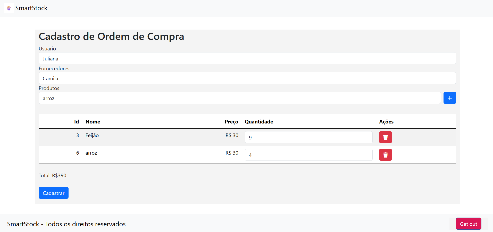
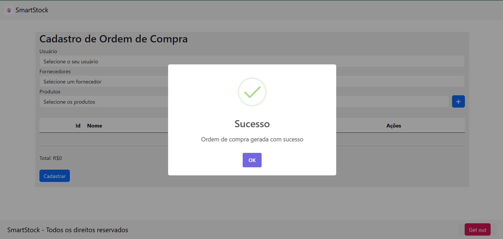
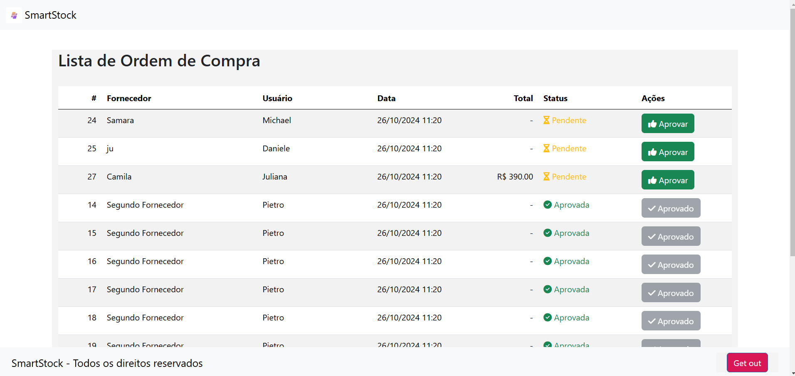
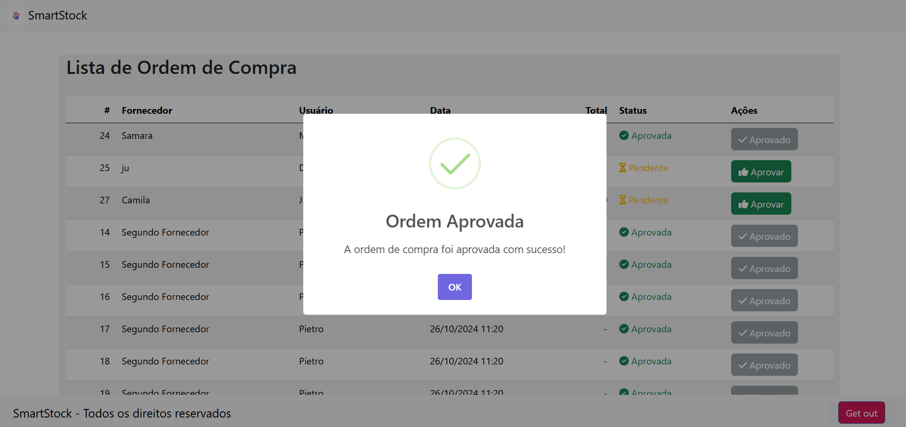
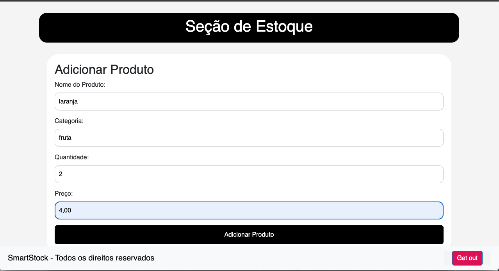
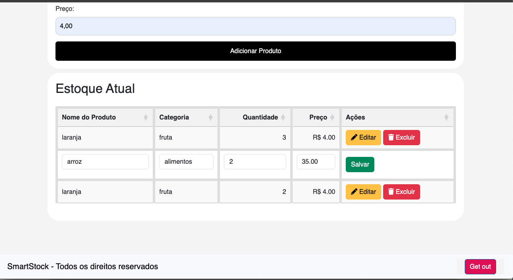

# Programação de Funcionalidades e  Instruções de acesso

# Instruções de acesso:

 <a href="https://smartstock-fjfcetdsg4ahfwcv.brazilsouth-01.azurewebsites.net/Home">Clique aqui para acessá-lo.</a>

--------------

# Página Cadastro de Fornecedor  

|ID    | Descrição do Requisito  | Tela Página Cadastro de Fornecedor | Juliana M |
|------|-----------------------------------------|----|----|
|RF-011| O sistema deve cadastrar o fornecedor e criar uma página informando que o cadastro foi realizado com sucesso. |  |  |
|RNF-005| O sistema deve ser acessível para navegadores web comuns (Chrome, Firefox) sem necessidade de plugins extras. |  |  |
|RF-12| O sistema deve permitir a inclusão de um novo fornecedor tendo incluso nome, email, telefone, endereço, cnpj.|  |  |

<figure>
  
</figure>

 

Ao clicar no botão de cadastrar fornecedor, você será redirecionado para a página de sucesso, onde uma mensagem de confirmação do cadastro do fornecedor será exibida.

<figure>

</figure>

<b>Página Lista de Fornecedor: </b>
 
 Passagem de Dados SQL para HTML.
 A primeira etapa foi executar uma query SQL em um banco de dados. Após a execução, os dados retornados foram formatados para exibição em HTML.

 <figure>
  
</figure>

 

# Página Cadastro de Produto

|ID    | Descrição do Requisito  | Tela Página Cadastro de Produto | Juliana M |
|------|-----------------------------------------|----|----|
|RF-013| O sistema deve cadastrar o produto e criar uma página informando que o cadastro foi realizado com sucesso. |  |  |
|RNF-005| O sistema deve ser acessível para navegadores web comuns (Chrome, Firefox) sem necessidade de plugins extras. |  |  |
|RNF-01| O sistema deve ter uma interface simples e fácil de usar, com design básico para facilitar a navegação para os funcionários da empresa.  |  | |
|RF-02| O sistema deve permitir a visualização de uma lista detalhada de todos os produtos cadastrados. | | |
|RF-14|O sistema deve cadastrar o produto e criar uma página informando que o cadastro foi realizado com sucesso.| | |

<figure>
  
</figure>

Ao clicar no botão de cadastrar produto , você será redirecionado para a página de sucesso, onde uma mensagem de confirmação do cadastro do produto será exibida.

<figure>

</figure>

<b>  Página Lista de Produtos:</b>

 Passagem de Dados SQL para HTML.

 A primeira etapa foi executar uma query SQL em um banco de dados. Após a execução, os dados retornados dos produtos adicionados foram formatados para exibição em HTML.

  
  <figure>
   
</figure>

---

# Página Cadastro de Usuário

|ID    | Descrição do Requisito  | Tela Página Cadastro de Usuário | Samara Raíssa |
|------|-----------------------------------------|----|----|
|RF-01| O sistema deve permitir o cadastro de um novo usuário com nome, telefone, cargo, email, senha e status. |  |  |
|RNF-02| O sistema deve ser responsivo e funcionar corretamente em dispositivos móveis e desktops. |  |  |
|RF-03| O sistema deve exibir uma mensagem de sucesso ao usuário após o cadastro ser realizado com sucesso.  |  | |
|RNF-04| O sistema deve ser compatível com navegadores web comuns, como Chrome, Firefox, Edge, sem necessidade de plugins extras. | | |
|RF-05|O sistema deve permitir visualizar as informações dos usuários cadastrados.| | |

<figure>
  

<figure>
  

<figure>
  

---

# Página Gestão de Estoque 

|ID    | Descrição dos Requisitos Funcionais  | Tela Página Gestão de Estoque | Michael Brasil |
|------|-----------------------------------------|----|----|
|RNF-02| O sistema deve ser responsivo e funcionar corretamente em dispositivos móveis e desktops. |  |  |
|RF-03|O sistema deve ter uma interface simples e fácil de usar, com design básico para facilitar a navegação para os funcionários da empresa.  |  | |
|RNF-04| O sistema deve ser compatível com navegadores web comuns, como Chrome, Firefox, Edge, sem necessidade de plugins extras. | | |
|RF-05|O sistema deve permitir visualizar os produtos que foram cadastrados.| | |
 

|| O restante dos Requisitos Funcionais serão feitos na próxima etapa 

 

|ID    | Descrição dos Requisitos Não Funcionais  | Tela Página Gestão de Estoque | Michael Brasil |
|------|-----------------------------------------|----|----|
|RNF-02|O sistema deve ter uma estrutura de código clara e bem documentada, para facilitar a compreensão e manutenção por estudantes. |  |  |
|RF-03|O sistema deve ser responsivo o suficiente para ser usado em diferentes tamanhos de tela, como monitores e laptops. |  | |
|RNF-04|Apenas usuários autenticados devem ter acesso ao sistema, com diferentes níveis de permissão conforme o perfil. | | |

 

<figure>
  

---

# Página de Cadastro de Ordem de Compra e Gestão de Ordem de Compra

### Requisitos Funcionais

| ID    | Descrição dos Requisitos Funcionais  | Tela Página Cadastro de Ordem de Compra | Responsável |
|-------|--------------------------------------|-----------------------------------------|-------------|
| RF-01 | O sistema deve permitir o cadastro de uma nova ordem de compra com usuário, fornecedor, produtos e status | OrdemDeCompra/CadastroOrdemDeCompra | Victor Magalhães |
| RF-03 | O sistema deve permitir a aprovação de ordens de compra cadastradas. | OrdemDeCompra/OrdensDeCompra | Victor Magalhães |

 

### Requisitos Não Funcionais

| ID    | Descrição dos Requisitos Não Funcionais  | Tela Página Cadastro de Ordem de Compra | Responsável |
|------|-----------------------------------------|---------------------------------------|-------------|
| RNF-01 | O sistema deve ter uma interface simples e fácil de usar, com design básico para facilitar a navegação para os funcionários da empresa. | OrdemDeCompra/CadastroOrdemDeCompra; OrdemDeCompra/OrdensDeCompra | Victor Magalhães |
| RNF-02 | O sistema deve ter uma estrutura de código clara e bem documentada, para facilitar a compreensão e manutenção por estudantes. | OrdemDeCompra/CadastroOrdemDeCompra; OrdemDeCompra/OrdensDeCompra | Victor Magalhães |
| RNF-03 | O sistema deve ser responsivo o suficiente para ser usado em diferentes tamanhos de tela, como monitores e laptops. | OrdemDeCompra/CadastroOrdemDeCompra; OrdemDeCompra/OrdensDeCompra | Victor Magalhães |
| RNF-04 | O sistema deve carregar rapidamente, com um tempo de resposta menor ou igual a 3 segundos. | OrdemDeCompra/CadastroOrdemDeCompra; OrdemDeCompra/OrdensDeCompra | Victor Magalhães |
| RNF-05 | O sistema deve ser acessível para navegadores web comuns (Chrome, Firefox) sem necessidade de plugins extras. | OrdemDeCompra/CadastroOrdemDeCompra; OrdemDeCompra/OrdensDeCompra | Victor Magalhães |

 

### Observações
- O restante dos requisitos funcionais e não funcionais serão tratados nas próximas etapas do projeto.
- Documentação será atualizada conforme o progresso do desenvolvimento e implementação das funcionalidades.

<figure>
  

<figure>
  

<figure>
  

<figure>
  

# Página Seção de Estoque 

|ID    | Descrição do Requisito  | Tela Seção de Estoque | |
|------|-----------------------------------------|----|----|
|RF-01|O sistema deve permitir o cadastro de produtos, incluindo atributos como nome, descrição, preço e quantidade em estoque.|  |  |
|RNF-005| O sistema deve ser acessível para navegadores web comuns (Chrome, Firefox) sem necessidade de plugins extras. |  |  |
|RNF-01| O sistema deve ter uma interface simples e fácil de usar, com design básico para facilitar a navegação para os funcionários da empresa.  |  | |
|RF-02| O sistema deve permitir a visualização de uma lista detalhada de todos os produtos cadastrados. | | |
|RF-04|O sistema deve remover a exclusão de produtos cadastrados. | |
|RF-03|	O sistema deve permitir a edição de itens cadastrados.| | |<figure>
  
</figure>

<figure>
  
</figure 

# Página de Login

|ID    | Descrição do Requisito  | Tela Seção de Estoque | |
|------|-----------------------------------------|----|----|
|RF-08| O sistema deve permitir a autenticação e autorização de usuários para acesso ao sistema de gestão de estoque, com diferentes níveis de permissão para gestores e colaboradores|  |  |

