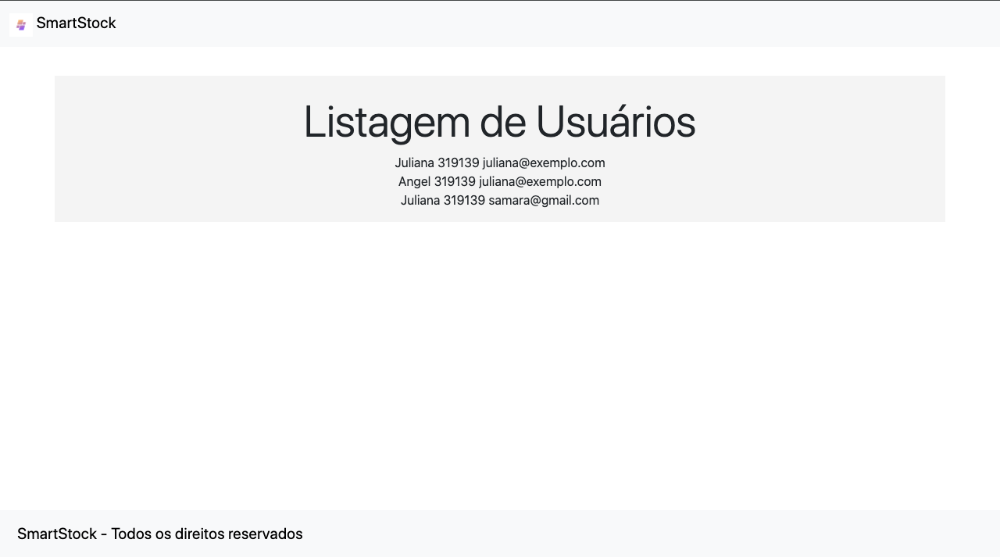
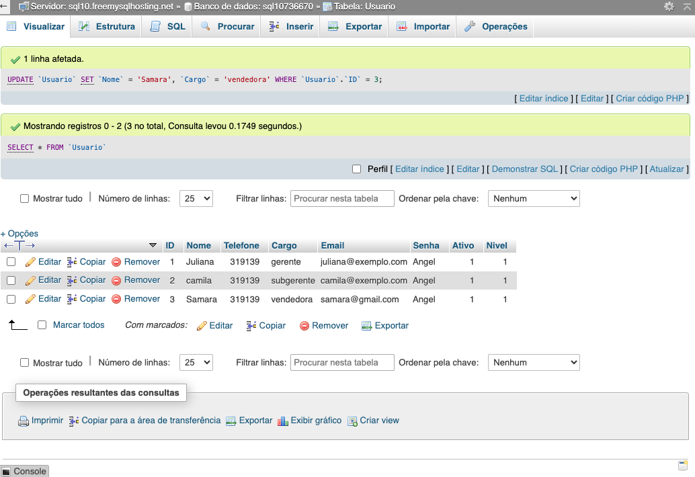
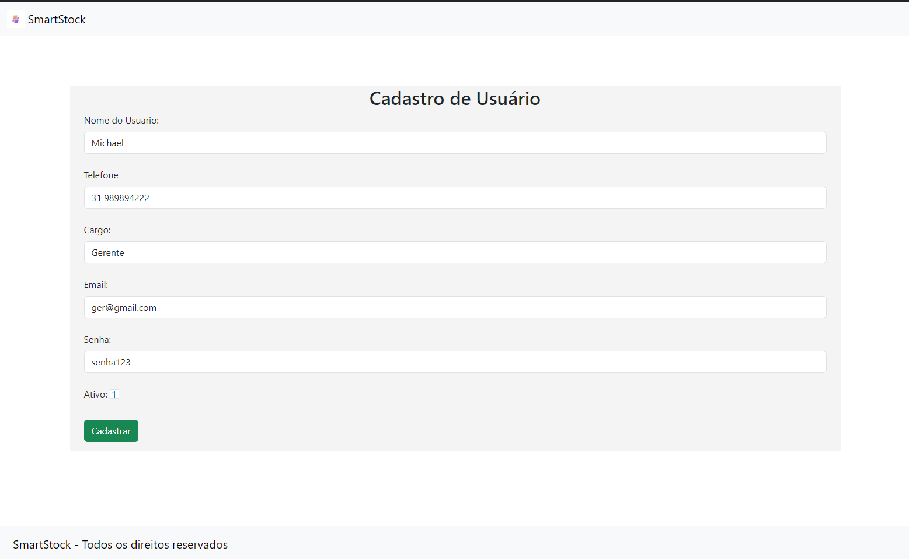
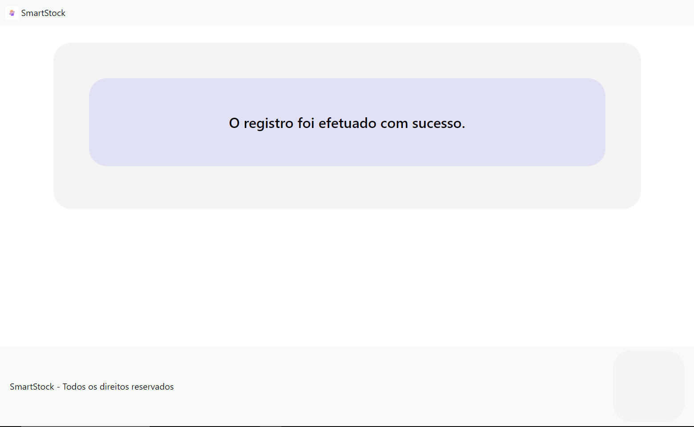
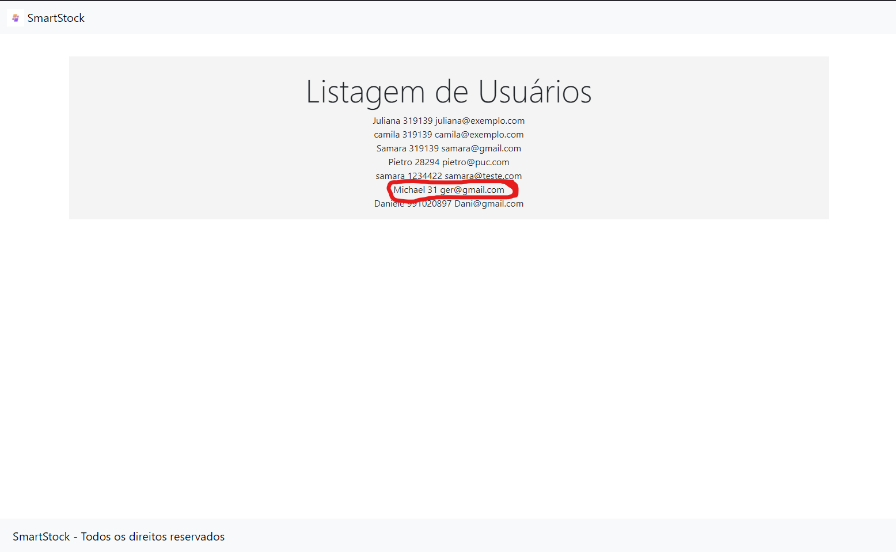
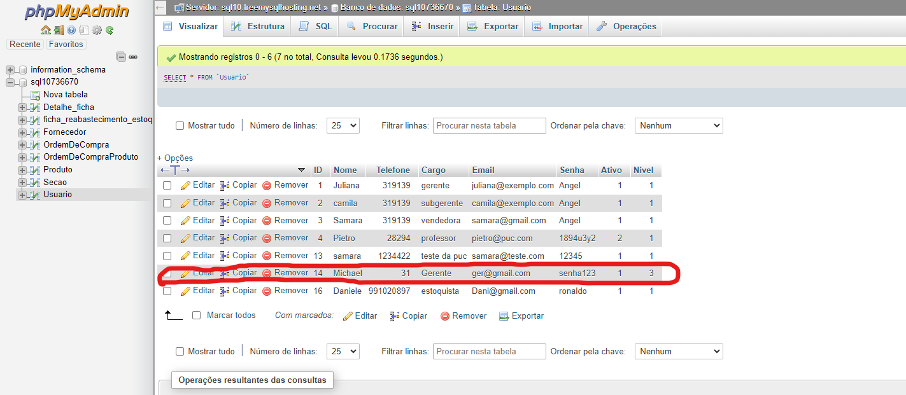
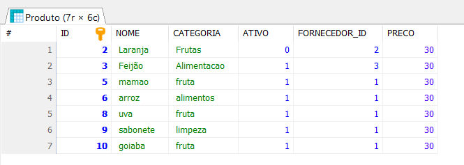

# Registro de Testes de Software

Pré-requisitos: <a href="3-Projeto de Interface.md"> Projeto de Interface</a>, <a href="8-Plano de Testes de Software.md"> Plano de Testes de Software</a>

 ## Caso de Teste 02: Cadastrar Produtos

 Testado por Camila Zatz 

 Criador da página: Juliana M.

| **Caso de Teste** 	| **CT-001 – Cadastro de Produto** 	|
|:---:	|:---:	|
|	Requisito Associado 	| RF-01 - O sistema deve permitir o cadastro de produtos, incluindo atributos como nome, descrição, preço e quantidade em estoque|
|Correspondeu ao Esperado| Sim, o comportamento do sistema atendeu aos requisitos. Os produtos foram cadastrados com sucesso e os dados foram devidamente armazenados. Ressalta-se, no entanto, a necessidade de incluir a quantidade dos produtos ||Registro de evidência 

 ## Caso de Teste 02: Tela Lista de Usuários

 Testado por Juliana M. 

 Criador da página: Samara Raíssa
| 

| **Caso de Teste** 	| **CT-02 – ** 	|
|:---:	|:---:	|
|	Requisito Associado 	| RF-14 - O sistema deve permitir a execução de consultas SQL em um banco de dados e a formatação dos dados retornados para exibição em uma página HTML.|
|Correspondeu ao Esperado|O sistema atendeu ao esperado, permitindo a execução de consultas SQL no banco de dados e a formatação correta dos dados retornados para exibição na página HTML.  |Registro de evidência | <figure> </figure> |
|Registro de evidência | <figure> </figure> | 

 

## Caso de Teste 03: Tela Cadastro de Usuários

 Testado por Michel Brasil 

 Criador da página: Samara Raíssa
| 

**Caso de Teste** 	| **CT-03 – Cadastro de Usuários 	
|:---:	|:---:	|
|	Requisito Associado 	| RF-01 - O sistema deve permitir o cadastro do Usuario, incluindo atributos como nome, telefone, cargo, email, ativo e senha |
|Correspondeu ao Esperado|Sim, o comportamento do sistema atendeu aos requisitos. Os usuários foram cadastrados com sucesso e os dados foram devidamente armazenados.| <figure> </figure> |
|Registro de evidência | <figure> </figure> | 
|Registro de evidência | <figure> </figure> |
|Registro de evidência | <figure> </figure> | 

 

## Caso de Teste 004: Tela Cadastro de Fornecedor

 Testado por Samara Raíssa 

 Criador da página: Juliana M.

| **Caso de Teste** 	| CT-04 – Tela Cadastro de Fornecedor 	|
|:---:	|:---:	|
|	Requisito Associado	| RF-01 -O sistema deve permitir a execução de consultas SQL em um banco de dados e a formatação dos dados retornados para exibição em uma página HTML.|
|Houve erro| Não, não houve erro.|
|Correspondeu ao Esperado| Sim, o comportamento do sistema correspondeu aos requisitos. |
|Registro de evidência | <figure> </figure> |
|Registro de evidência | <figure> </figure> | 
|Registro de evidência | <figure> </figure> |
|Registro de evidência | <figure> </figure> | 

 

## Caso de Teste 005: Tela Cadastro Ordem de Compra 

 Testado por Samara Raíssa 

 Criador da página: Victor Magalhães

| **Caso de Teste** 	| CT-05 – Cadastro Ordem de Compra 	|
|:---:	|:---:	|
|	Requisito Associado 	| RF-01 - O sistema deve permitir a execução de consultas SQL em um banco de dados, o processamento das informações retornadas e a formatação para exibição em uma página HTML, com opções de aprovação e controle de status de ordens de compra.|
|Houve erro| Não, não houve erro.|
|Correspondeu ao Esperado| Sim, o comportamento do sistema correspondeu aos requisitos. |
|Registro de evidência | <figure> </figure> |
|Registro de evidência | <figure> </figure> | 
| **Caso de Teste** 	| **Ordens de Compra** 	|
|Registro de evidência | <figure> </figure> |
|Registro de evidência | <figure> </figure> | 

 

## Caso de Teste 002: Execução de Consultas SQL

 Testado por Victor Magalhães 

 Criador da página: Michael Benyamin Gorenstein Brasil

| **Caso de Teste** 	| CT-02 – Execução de Consultas SQL 	|
|:---:	|:---:	|
|	Requisito Associado 	| RF-14 - O sistema deve permitir a execução de consultas SQL em um banco de dados e a formatação dos dados retornados para exibição em uma página HTML. |
| Houve erro | Não, não houve erro. |
| Correspondeu ao Esperado | Sim, o comportamento do sistema correspondeu aos requisitos. |
| Registro de evidência | <figure></figure> |
| Registro de evidência | <figure></figure> |

---

## Caso de Teste 004: Visualização de Relatório de Estoque

 Testado por Victor Magalhães 

 Criador da página: Michael Benyamin Gorenstein Brasil

| **Caso de Teste** 	| CT-004 – Visualização de Relatório de Estoque 	|
|:---:	|:---:	|
|	Requisito Associado 	| RF-02 - O sistema deve permitir ao usuário visualizar relatórios de estoque com dados filtrados por categoria, com a possibilidade de geração de relatórios detalhados. |
| Houve erro | Não, não houve erro. |
| Correspondeu ao Esperado | Sim, o comportamento do sistema correspondeu aos requisitos. |
| Registro de evidência | <figure></figure> |
| Registro de evidência | <figure></figure> |

